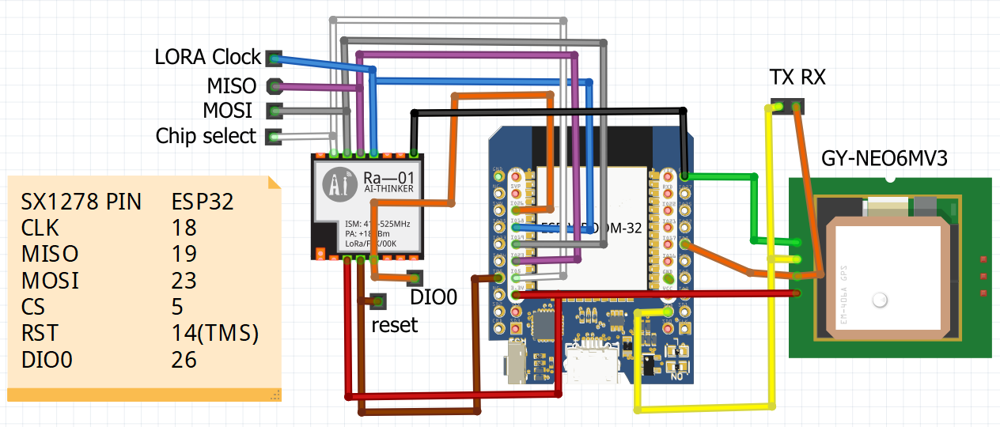
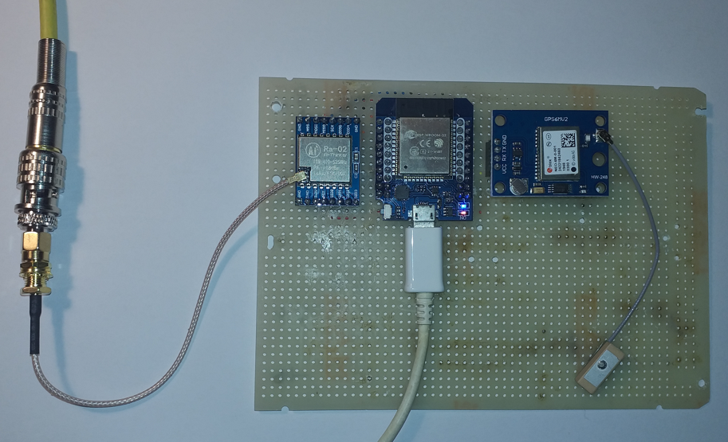

# Introduction
This project is forked from https://github.com/sh123/esp32_loraprs to reduce it to a simple LoRa APRS beacon and tracker, but adding a GPS module.

In this configuration, it reads the GPS coordinates (latitude and longitude) and sends them to a LoRa APRS digipeater with the following settings:

- #define CFG_LORA_FREQ         433.775e6 
- #define CFG_LORA_BW           125e3
- #define CFG_LORA_SF           10
- #define CFG_LORA_CR           5
- you can change them in the file https://github.com/guido57/esp32_loraprs_gps/config.h, according to the settings of the digipeater you want to transmit to.

# Wirings

# Prototype

See the 432 MHz antenna connection on the left and the small GPS antenna on the right

# About the original project

This is a simple beacon and tracker.

For this reason, the functions: 
- LoRa APRSDroid KISS Bluetooth modem
- LoRa APRS-IS RX/TX iGate server over WiFI
- digipeater
- Codec2 DV modem
are disabled in config.h, but can be enabled again 

- For project description, please, visit our Wiki at https://github.com/sh123/esp32_loraprs/wiki
- For discussions, visit https://github.com/sh123/esp32_loraprs/discussions
